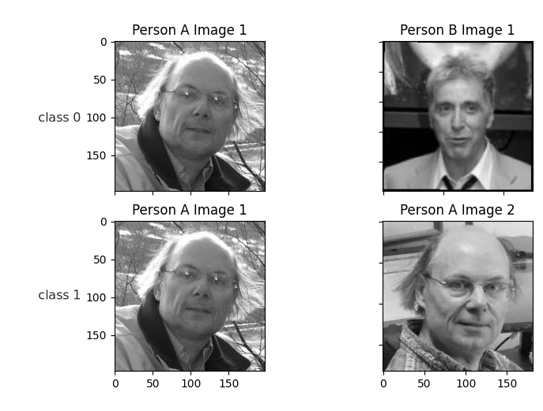

# oneshotlearning
This repository is the required code for the project "Applied Framework for One-shot Face Recognition using Siamese
Neural Networks" for the Toronto Metropilitan University course EE8223: Deep Learning with Dr. Illanko.

The project uses a deep siamese neural network pair to perform face recognition. We developed a GUI to allow for tunable hyper-parameters. We train the network on two datasets, Labelled Faces in the Wild (LFW), and Youtube Faces (YTF). The data setup can be found below.



- Note: latest results have not been  uploaded to github yet. Do not use the "results.csv" file as a reference. 
## Quick Start

Clone this repository, using
1. `git clone https://github.com/husseinalijaafar/oneshotlearning`
2. `cd` to `oneshotlearning`/ and run
3. `pip install -r requirements.txt`
4. Set up the data as shown below
5. run: `python3 MainWindow.py`
6. Select your required configuration, change layer sizes, activation functions etc. 
7. Click "Initialize Network"


## Data set up

 Download the following dataset: 
- [LFW](https://talhassner.github.io/home/projects/lfwa/index.html) 
- [LFW_train.txt](http://vis-www.cs.umass.edu/lfw/pairsDevTrain.txt)
- [LFW_train.txt](http://vis-www.cs.umass.edu/lfw/pairsDevTest.txt)
- [YTF](https://drive.google.com/file/d/1govqMpb_nE5EJqNqWEkq11lOPt7lIdhA/view?usp=share_link)

Extract and arrange the data in the following setups

The dataset folder should appear as
```
dataset
  lfw2
    lfw2
      ...
    splits
      train.txt
      test.txt
    weights
      ...
  ytf
    ytf_split
      test
      train
      val
      test.txt
      train.txt
```

For questions or concerns, please open an Issue on GitHub. 
## Credits
- Original paper is [Gregory Koch, Richard Zemel, Ruslan Salakhutdinov](https://www.cs.cmu.edu/~rsalakhu/papers/oneshot1.pdf)
- Some of the network code used is from [Nevoit](https://github.com/nevoit/Siamese-Neural-Networks-for-One-shot-Image-Recognition
- Datasets: [LFW](https://talhassner.github.io/home/projects/lfwa/index.html) [YTF](https://www.cs.tau.ac.il/~wolf/ytfaces/)